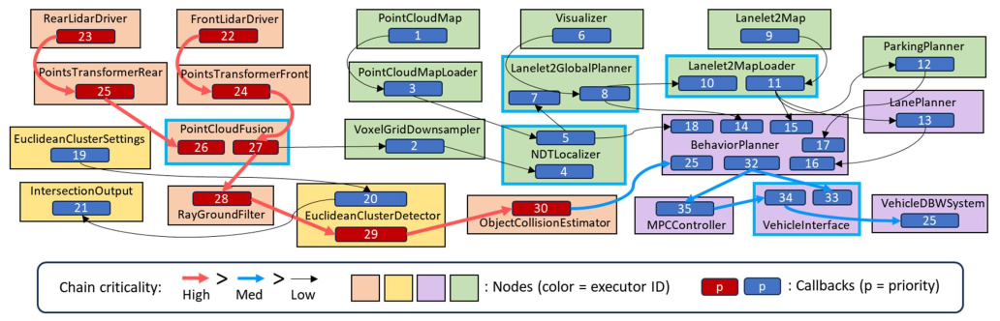
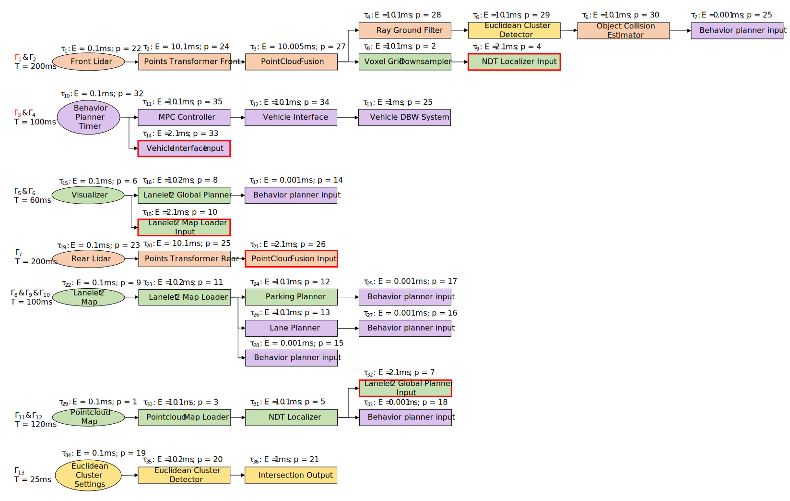

# Overview

A modified and analyzable version of the Autoware Reference system from [Apex.AI](https://apex.ai) and a modified version of default and picas-enabled rclcpp to inlcude automatic latency management for processing chains at the executor level. Uses ROS2 Humble as base ROS version.

Future _reference systems_ could be proposed that are more complex using the same basic node building blocks within the `reference_system` package.

## Analyzable Chain Breakdown 
The modified system breaks down into 13 analyzable chains as follows:

## Reference System

A _reference system_ is defined by:
- A [platform](#supported-platforms) is defined by:
    - Hardware (e.g. an off-the-shelf single-board computer, embedded ECU, etc.)
        - if there are multiple configurations available for such hardware, ensure it is specified
    - Operating System (OS) like RT linux, QNX, etc. along with any special configurations made
- for diversity of benchmarking, **all nodes can be run on a single process, or be split across multiple processes**
- a fixed number of nodes
    - each node with:
        - a fixed number of publishers and subscribers
        - a fixed _processing time_ or a fixed _publishing rate_
- a fixed _message type_ of fixed size to be used for every _node_.

With these defined attributes the _reference system_ can be replicated across many different possible configurations to be used to benchmark each configuration against the other in a reliable and fair manner.

With this approach [portable and repeatable tests](#testing) can also be defined to reliably confirm if a given _reference system_ meets the requirements.

## Supported Platforms

To enable as many people as possible to replicate this reference system, the platform(s) were chosen to be easily accessible (inexpensive, high volume), have lots of documentation, large community use and will be supported well into the future.

Platforms were not chosen for performance of the reference system - we know we could run “faster” with a more powerful CPU or GPU but then it would be harder for others to validate findings and test their own configurations.  Accessibility is the key here and will be considered if more platforms want to be added to this benchmark list.

**Platforms:** 
 - [Raspberry Pi 4B](https://www.raspberrypi.org/products/raspberry-pi-4-model-b/):
    - 4 GB RAM version is the assumed default
        - other versions could also be tested / added by the community
    - [real-time linux kernel](https://github.com/ros-realtime/rt-kernel-docker-builder)
- [Nvidia Jetson AGX Xavier](https://www.nvidia.com/en-in/autonomous-machines/embedded-systems/jetson-agx-xavier/)
    - 32 GB RAM version is assumed default
    - Linux kernel 5.10.120-tegra SMP PREEMPT
    - Volta Architecture GPU with unified memory

## Concept Overview

Rather than trying to write code to cover all potential variations of executors, APIs, and future features we cannot even imagine today we have chosen instead to define what we call a “reference system” based on part of a real-world system, [Autoware.Auto](https://www.autoware.org/autoware-auto).

The above node graph can be boiled down to only a handful of node "types" that are replicated to make this complex system:

**Node Types:**

1. [**Sensor Node**](reference_system/include/reference_system/nodes/rclcpp/sensor.hpp)
    - input node to system
    - one publisher, zero subscribers
    - publishes message cyclically at some fixed frequency
2. [**Transform Node**](reference_system/include/reference_system/nodes/rclcpp/transform.hpp)
    - one subscriber, one publisher
    - starts processing for N milliseconds after a message is received
    - publishes message after processing is complete
3. [**Fusion Node**](reference_system/include/reference_system/nodes/rclcpp/fusion.hpp)
    - 2 subscribers, one publisher
    - One subscriber caches input, the other triggers processing and publishing
    - starts processing for N milliseconds after a message is received **from a specific (configurable)** subscription
    - publishes message after processing is complete
4. [**Cyclic Node**](reference_system/include/reference_system/nodes/rclcpp/cyclic.hpp)
    - N subscribers, one publisher
    - cyclically processes all received messages since the last cycle for N milliseconds
    - publishes message after processing is complete
5. [**Command Node**](reference_system/include/reference_system/nodes/rclcpp/command.hpp)
    - prints output stats everytime a message is received
6. [**Intersection Node**](reference_system/include/reference_system/nodes/rclcpp/intersection.hpp)
    - behaves like N transform nodes
    - N subscribers, N publisher bundled together in one-to-one connections
    - starts processing on connection where sample was received
    - publishes message after processing is complete

These basic building-block nodes can be mixed-and-matched to create quite complex systems that replicate real-world scenarios to benchmark different configurations against each other.

## Reference Systems Overview

The first reference system benchmark proposed is based on the *Autoware.Auto* lidar data pipeline as stated above and shown in the node graph image above as well.

1. [**Autoware Reference System**](autoware_reference_system/README.md)
    - ROS2:
        - Executors:
            - Default:
                - [Single Threaded](autoware_reference_system/src/ros2/executor/autoware_default_singlethreaded.cpp)
                - [Static Single Threaded](autoware_reference_system/src/ros2/executor/autoware_default_staticsinglethreaded.cpp)
                - [Multithreaded](autoware_reference_system/src/ros2/executor/autoware_default_multithreaded.cpp)
                - [Multiple Single Threaded](autoware_reference_system/src/ros2/executor/autoware_default_multi_singlethreaded.cpp)

## Testing and Dependencies

Tests and dependencies will be written uniquely for each _reference system._

Please go to the `README.md` file specific for the _reference system_ you would like to run to view the instructions on how to set it up and run yourself.

- [Autoware Reference System](autoware_reference_system/README.md)

### PICAS Executor
Use `-DPICAS=TRUE` to build the [PICAS executor](https://github.com/rtenlab/ros2-picas). For more details, see [README.md](autoware_reference_system/README.md) in `Autoware Reference System`.

### Latency Management Executor
Use `-DLAME=TRUE` to build the [Latency Management executor](ros2-picas). For more details, see [README.md](autoware_reference_system/README.md) in `Autoware Reference System`.

